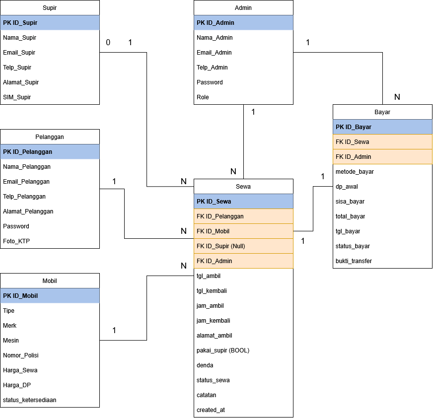

# Analisis Data Rental Mobil — SQL & Tableau

Project analisis data end-to-end untuk bisnis rental mobil: mulai dari perancangan database relasional, penulisan query SQL untuk menjawab pertanyaan bisnis, hingga visualisasi dashboard interaktif.

**Oleh:** Muhammad Jiddan Gumilang
|| [email](mailto:muhammadjiddan.g@gmail.com) || [LinkedIn](https://www.linkedin.com/in/muhammadjiddangumilang) || [Tableau Public](https://public.tableau.com/views/Analisis_rentalMobil/Analisis_Pembayaran?:language=en-US&:sid=&:redirect=auth&:display_count=n&:origin=viz_share_link)

---

## Ringkasan Project

Data analyst tidak mulai dari data — tapi dari pertanyaan bisnis. Project ini mensimulasikan proses tersebut untuk sebuah bisnis rental mobil:

```
Pertanyaan Bisnis → Cari Data → Analisis (SQL) → Insight → Rekomendasi Bisnis
```

**Cakupan pekerjaan:**
- Merancang ERD dan skema database relasional dari nol
- Membuat 6 tabel (4 tabel master, 2 tabel transaksi) dengan relasi PK/FK
- Menulis 17 query SQL analitik terbagi ke dalam 4 area bisnis — mayoritas mandiri, sebagian kecil dengan arahan AI saat menemui kebuntuan teknis (lihat catatan di bagian bawah)
- Menerjemahkan hasil query menjadi business insight dan rekomendasi
- Membangun 5 dashboard interaktif di Tableau Public

---

## Struktur Database



| Tabel | Jenis | Jumlah Data | Fungsi |
|---|---|---|---|
| `pelanggan` | Master | 300 | Data penyewa mobil |
| `mobil` | Master | 20 | Data unit armada |
| `supir` | Master | 15 | Data supir pendamping |
| `admin_rental` | Master | 5 | Data petugas yang memproses transaksi |
| `sewa` | Transaksi | 500 | Mencatat proses penyewaan |
| `bayar` | Transaksi | 500 | Mencatat proses pembayaran |

**Kenapa `sewa` dan `bayar` dipisah?** Karena keduanya merepresentasikan kejadian bisnis yang berbeda (proses sewa vs proses bayar), menghindari kolom NULL berlebih, dan lebih fleksibel untuk pengembangan (misal: cicilan, refund). Detail lengkap ada di [`database/erd.png`](database/erd.png) dan [`database/schema.sql`](database/schema.sql).

---

## Tech Stack

`Oracle SQL (Oracle Apex)` · `PL/SQL` · `Tableau Public` · `Draw.io / Lucidchart (ERD)`

**Konsep SQL yang diterapkan:** JOIN (INNER/LEFT/RIGHT), GROUP BY + fungsi agregat, HAVING vs WHERE, Window Function (`OVER()`), CASE WHEN.

---

## Struktur Repo

```
rental-mobil-data-analysis/
│
├── README.md
├── database/
│   ├── erd.png
│   ├── schema.sql          # CREATE TABLE untuk 6 tabel
├── queries/
│   ├── 01_revenue_keuangan.sql
│   ├── 02_analisis_pelanggan.sql
│   ├── 03_performa_mobil.sql
│   └── 04_performa_supir.sql
├── data/                   # export CSV tiap tabel
|   ├── mobil.csv
|   ├── admin_rental.csv
|   ├── bayar.csv
|   ├── sewa.csv
|   ├── supir.csv
|   ├── mobil.csv
└── docs/
    └── portfolio-summary.pdf
```

---

## Area 1 — Revenue & Keuangan

| Query | Insight Utama |
|---|---|
| Total pendapatan per bulan | Peak revenue di Juni (Rp214.9M) dan Desember (Rp223.9M) — bertepatan dengan musim liburan |
| Pendapatan per kuartal | Q4 kuartal terkuat; Q3 (Jul–Sep) paling lemah, berpotensi untuk promo early bird |
| Kontribusi denda | Denda berkontribusi kecil terhadap revenue, namun konsisten tiap bulan → indikasi pola keterlambatan berulang |
| Kerugian transaksi batal | Dihitung dari potensi pendapatan (harga sewa × lama reservasi), dasar untuk kebijakan cancellation fee |
| Rata-rata nilai transaksi (AOV) | Fluktuasi AOV mengindikasikan perbedaan preferensi tipe mobil & durasi sewa antar bulan |

📄 Query lengkap: [`queries/01_revenue_keuangan.sql`](queries/01_revenue_keuangan.sql)

> ⚠️ **Catatan revisi:** beberapa insight di atas masih bersifat umum (belum mencantumkan angka spesifik untuk semua klaim). Sedang direvisi agar setiap insight memuat angka dari data + alasan + implikasi bisnis yang jelas.

##  Area 2 — Perilaku Pelanggan

| Query | Insight Utama |
|---|---|
| Top 10 pelanggan aktif | Pelanggan teratas 33% lebih aktif dari rata-rata → kandidat program loyalty |
| Pengeluaran tertinggi | Pelanggan top spender mengeluarkan hampir 2× lipat peringkat kedua |
| Keterlambatan berulang | Pola keterlambatan pada pelanggan tertentu → kandidat sistem reminder/deposit |
| Penggunaan supir | 39% transaksi menggunakan supir — potensi upsell saat booking |
| Churn (1x transaksi) | 92 pelanggan (38% dari total aktif) hanya bertransaksi 1x → kandidat win-back campaign |

📄 Query lengkap: [`queries/02_analisis_pelanggan.sql`](queries/02_analisis_pelanggan.sql)

##  Area 3 — Performa Armada Mobil

| Query | Insight Utama |
|---|---|
| Mobil paling sering disewa | Toyota mendominasi (25% dari total transaksi), MPV tipe terlaris |
| Pendapatan per unit | Daihatsu City Car pendapatan tertinggi meski bukan tersering — indikasi durasi sewa lebih panjang |
| Rata-rata lama sewa | Mengungkap utilization rate per unit mobil |
| Mobil aktivitas rendah | Kandidat rotasi armada atau promo khusus agar tidak idle |

📄 Query lengkap: [`queries/03_performa_mobil.sql`](queries/03_performa_mobil.sql)

> ⚠️ **Catatan revisi:** "indikasi durasi sewa lebih panjang" dan beberapa insight lain di area ini masih dugaan, belum dicek dengan angka aktual dari query lama sewa. Perlu divalidasi sebelum jadi versi final.

##  Area 4 — Performa Supir

| Query | Insight Utama |
|---|---|
| Supir paling sering ditugaskan | Gap 2.3× antara supir tersibuk dan tersedikit → perlu sistem rotasi lebih adil |
| Pendapatan per supir | Korelasi kuat antara frekuensi penugasan dan pendapatan |
| Supir belum ditugaskan | Semua 15 supir aktif beroperasi — indikasi manajemen SDM yang baik |

📄 Query lengkap: [`queries/04_performa_supir.sql`](queries/04_performa_supir.sql)

---

## Dashboard (Tableau Public)

Lihat dashboard interaktif lengkap di 📊 [Tableau Public](https://public.tableau.com/views/Analisis_rentalMobil/Analisis_Pembayaran?:language=en-US&:sid=&:redirect=auth&:display_count=n&:origin=viz_share_link).

| Dashboard | Isi | Key Metric |
|---|---|---|
| Overview Bisnis | KPI cards + tren pendapatan bulanan | Rp1.07B total revenue 2024 |
| Performa Mobil | Bar chart terlaris, pendapatan, denda per mobil | Toyota MPV #1 terlaris |
| Analisis Pelanggan | Top 10 pelanggan, spending, penggunaan supir | Cahyo Purnomo #1 VIP |
| Analisis Pembayaran | Distribusi metode & status transaksi | 79% transaksi lunas |
| Performa Supir | Ranking, pendapatan, penugasan supir | Ganda Putra #1 produktif |

---

##  Key Recommendations

- Alokasikan armada maksimal di periode peak season (Juni & Desember)
- Program promo early bird / paket weekend untuk mengangkat performa Q3
- Sistem reminder H-1 pengembalian untuk menekan denda dan keterlambatan
- Program loyalty untuk top 10 pelanggan; win-back campaign untuk 92 pelanggan churn
- Evaluasi diversifikasi armada agar tidak terlalu bergantung pada satu merk (Toyota 25%)
- Sistem rotasi penugasan supir yang lebih merata

Detail insight dan narasi bisnis lengkap ada di [`docs/portfolio-summary.pdf`](docs/portfolio-summary.pdf).

---

##  Catatan Proses & Keterlibatan AI

Dataset pada project ini adalah **data dummy**, digenerate untuk keperluan pembelajaran dan portofolio — bukan data operasional perusahaan nyata.

Sebagai bentuk transparansi soal penggunaan AI dalam project ini:

- **17 query SQL** ([`queries/`](queries/)) sebagian besar saya tulis mandiri. 1–3 query disusun dengan arahan Claude (Anthropic) saat saya menemui kebuntuan teknis — proses koreksi dan penjelasannya menjadi bagian dari proses belajar saya.
- Perancangan ERD, skema database, dan seluruh business insight adalah hasil pemikiran dan revisi saya sendiri, dengan AI sebagai partner diskusi untuk mengecek logika dan memberi umpan balik.

Saya percaya AI adalah alat bantu, bukan pengganti proses belajar — sehingga kejelasan soal apa yang saya kerjakan mandiri vs. dengan bantuan penting untuk dicantumkan di sini.
